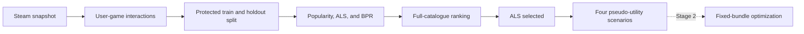

# Steam Bundle Recommendation and Optimization

UROP project supervised by Dr Li Xiaobo at NUS.

**Status: Stage 1 complete. Stage 2 is next.**

This project asks two linked questions:

1. Can implicit-feedback models recover held-out Steam ownership better than popularity?
2. Given the resulting preference scores, which fixed bundle should a seller offer?

Stage 1 answers the first question and fixes the score transformations that Stage 2 will use. Stage
2 will formulate and solve the bundle-design problem. I keep the two stages separate because a
ranking score is not automatically a monetary valuation.



## Stage 1 result

The current cycle is `s1-v2-20260814`. It contains 70,912 active users, 5,094,082 deduplicated
ownership edges, and 10,978 games. Evaluation uses 8,902 warm games and a fixed sample of 5,000
design users.

| Model | NDCG@20 | Recall@20 | Decision |
| --- | ---: | ---: | --- |
| Popularity | 0.135350 | 0.2524 | Baseline |
| Identity BPR, three-seed mean | 0.133170 | 0.2725 | Not admitted |
| Identity + genre BPR, three-seed mean | 0.077396 | 0.1697 | Not admitted |
| Ownership-only ALS, three-seed mean | **0.206089** | **0.4196** | **Admitted** |

The selected model is 64-factor implicit ALS with regularization 0.05 and alpha 20. Its paired
NDCG@20 improvement over popularity is 0.070739. The conditional 95% user-bootstrap interval is
[0.062947, 0.078603].

The BPR and genre results apply only to this implementation and protocol. I do not interpret them
as evidence that BPR or genre features fail in general.

The full result, evaluation population, and claim limits are in the
[Stage 1 model card](notes/stage1_model_card.md). The
[post-freeze audit](notes/stage1_release_audit.md) records issues found after the cycle was closed.

## Evaluation design

The main choices were:

- use numeric Steam IDs and fieldwise maxima to consolidate duplicate records;
- split users before tuning and keep assessment users outside model selection;
- rank each target against the complete warm catalogue;
- mask training positives and the user's other held-out positive;
- calculate exact expected metrics at score ties;
- select configurations using validation only;
- average stochastic models over three fixed seeds; and
- refit the admitted model on restored design data before folding in assessment users.

These choices make the result a held-out ownership-ranking result. They do not turn ownership into
a rating, a purchase occasion, or willingness to pay.

## What is complete

The descriptive notebooks establish what the archive contains and why the original pricing route
was changed:

- notebooks 00 to 05 clean the snapshot and build ownership-based bundle proxies;
- notebooks 06 and 10 preserve the retired cross-moment bundle-size pricing route;
- notebooks 07 to 09 preserve the first feature, factor-model, and calibration experiments; and
- the live Stage 1 model comparison is implemented in tested `src/stage1_*` modules.

The first approach priced a menu where a customer chooses the bundle size. Steam's snapshot instead
contains fixed compositions, so that mechanism did not match the final question. Stage 2 will use a
Single Bundle with All model: one curated bundle is offered while its games remain available
separately. SBR is retained only as a separate theoretical benchmark.

Planned Stage 2 work:

1. freeze candidate pools, costs, capacities, tie rules, and search budgets;
2. implement exact fixed-composition pricing;
3. certify small composition-search instances;
4. compare the scalable search method with exact solutions on locked test instances; and
5. evaluate complete policies on assessment users without reoptimization.

The binding order and gates are in [planning.md](planning.md).

## Setup and checks

The audited environment used Python 3.10.11.

```text
python -m pip install -r requirements-frozen.txt
python -m pip check
python -m pytest -p no:cacheprovider --strict-markers -q
python -m src.stage1_public_verify
```

The test suite currently has 211 tests. The public verifier checks file hashes, manifest IDs,
cycle IDs, run inventories, and cross-manifest links. It allows raw and protected files to be
absent from a public clone, but it fails if a required public file is missing or changed.

There are three different levels of reproducibility:

| Check | Command | What it checks |
| --- | --- | --- |
| Public evidence | `python -m src.stage1_public_verify` | Published files and evidence links |
| Unit and contract tests | `python -m pytest ...` | Numerical and implementation contracts |
| Completed private run | `python -m src.stage1_pipeline` | Exact raw and protected local artifacts |

The pipeline command is not a clean-clone retraining command. Full retraining still requires an
authorized copy of the source archive and a separate rebuild procedure.

## Repository map

```text
configs/       frozen model and evaluation settings
data/raw/      source data, not tracked
notebooks/     descriptive work and archived prototypes
notes/         model card, assumptions, mathematics, and research log
outputs/       aggregate tables, figures, manifests, and run logs
src/           estimators, ranking, artifact generation, and verification
tests/         numerical and integrity tests
planning.md    project plan, decision gates, and completion record
```

Useful starting points:

- [Stage 1 model card](notes/stage1_model_card.md)
- [Stage 1 mathematical appendix](notes/stage1_v2_mathematical_appendix.md)
- [Stage 1 evidence summary](outputs/modeling/cycles/s1-v2-20260814/stage1_evidence_summary.md)
- [Assumptions and limitations](notes/assumptions_and_limitations.md)
- [Research log](notes/research_log.md)
- [Data dictionary](notes/data_dictionary.md)

## Data and provenance

I downloaded the
[Steam Video Game and Bundle Data mirror](https://www.kaggle.com/datasets/pypiahmad/steam-video-game-and-bundle-data)
on 2026-06-05. The archive checksum and field-level provenance are recorded in
[DATA_PROVENANCE.md](DATA_PROVENANCE.md).

The source traces to the [UCSD Steam dataset
page](https://cseweb.ucsd.edu/~jmcauley/datasets.html#steam_data) and Pathak, Gupta, and McAuley
(2017), ["Generating and Personalizing Bundle Recommendations on
Steam"](https://doi.org/10.1145/3077136.3080724).

The archive does not include the paper's user-to-bundle interaction file. `users_own_all` is
therefore an upper-bound ownership-compatibility proxy, not a reconstructed purchase label.

Raw records, reviews, user identifiers, protected split coordinates, per-user metrics, and fitted
user parameters are not tracked. The mirror does not state a clear redistribution license, so the
right to publish the derived tables and figures must be confirmed before the repository is made
public.

## Scope

The results support a narrow claim: under this split and ranking protocol, ownership-only ALS
reconstructed held-out warm-item ownership better than the tested alternatives.

They do not estimate:

- future purchases;
- causal effects of genre, prices, or discounts;
- willingness to pay or utility in dollars;
- current performance on Steam's global population; or
- actual seller revenue.

The four Stage 1 score transformations are declared pseudo-utility scenarios. Stage 2 must report
how bundle decisions change across them instead of treating one transformation as the true scale.

## Citation

Repository citation metadata are in [CITATION.cff](CITATION.cff). Dataset users should also cite
the UCSD source and the SIGIR 2017 bundle paper above.
