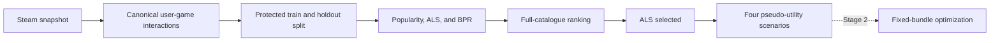
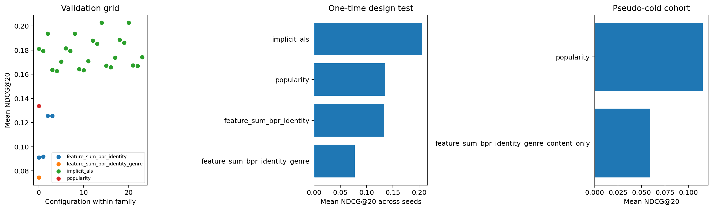

# Steam Recommendation and Bundle Optimization

[](https://github.com/pranavpillaiNUS/steam-recommendation-and-bundle-optimization/actions/workflows/ci.yml)
[](requirements-frozen.txt)
[](notes/stage1_model_card.md)

Leakage-controlled implicit-feedback recommendation followed by fixed-bundle optimization on a
historical Steam dataset.

NUS Undergraduate Research Opportunities Programme project supervised by Dr Li Xiaobo.

**Project status:** Stage 1 is complete under cycle `s1-v2-20260814`. Stage 2 implementation is
paused through November 2026 while I study the optimization literature and prepare its protocol.
The Stage 1 evidence remains frozen and independently checkable during this period.

[Result](#stage-1-result) · [Method](#method) · [Quick start](#quick-start) ·
[Evidence](#evidence-and-reproducibility) · [Roadmap](#roadmap) ·
[Limitations](#scope-and-limitations)

## About the project

This project connects two questions that are often treated separately:

1. Can implicit-feedback models recover held-out Steam ownership better than popularity?
2. Given the resulting preference scores, which fixed bundle should a seller offer?

Stage 1 answers the recommendation question and freezes four explicit score transformations for
Stage 2. Stage 2 will formulate and solve the bundle-design problem. I keep the stages separate
because a ranking score is not automatically a monetary valuation.



### At a glance

| Item | Current state |
| --- | --- |
| Dataset scale | 70,912 active users, 10,978 games, 5,094,082 ownership edges |
| Evaluation | 5,000 fixed design users against 8,902 warm games |
| Model families | Popularity, weighted implicit ALS, identity BPR, identity + genre BPR |
| Selected model | 64-factor ownership-only implicit ALS |
| Primary result | NDCG@20 0.206089 versus 0.135350 for popularity |
| Public verification | 12 manifests, 91 run logs, 11 outputs, and 147 public references |
| Next research stage | Fixed-composition bundle optimization |

## Stage 1 result

Only the ownership-only ALS configuration passed the predeclared admission rule.

| Model | NDCG@20 | Recall@20 | Decision |
| --- | ---: | ---: | --- |
| Popularity | 0.135350 | 0.2524 | Baseline |
| Identity BPR, three-seed mean | 0.133170 | 0.2725 | Not admitted |
| Identity + genre BPR, three-seed mean | 0.077396 | 0.1697 | Not admitted |
| Ownership-only ALS, three-seed mean | **0.206089** | **0.4196** | **Admitted** |

The selected configuration uses 64 latent factors, regularization 0.05, and ownership confidence
alpha 20. Its paired NDCG@20 improvement over popularity is 0.070739. The conditional 95% user
bootstrap interval is [0.062947, 0.078603].



The BPR and genre results apply only to this implementation and evaluation protocol. They are not
evidence that BPR or content features fail in general. The [Stage 1 model
card](notes/stage1_model_card.md) defines the supported claims and evaluation population.

## Method

The Stage 1 evaluation was designed around a few strict choices:

- canonicalize users with numeric Steam IDs and consolidate duplicates with fieldwise maxima;
- partition users before tuning and keep assessment users outside model selection;
- rank every target against the complete 8,902-item warm catalogue;
- mask training positives and each user's other held-out positive;
- compute exact expected metrics at score ties;
- select configurations using validation only;
- average stochastic families over three fixed seeds; and
- refit the admitted model on restored design data before folding in assessment users.

These choices produce a held-out ownership-ranking result. They do not turn ownership into a
rating, purchase occasion, or willingness-to-pay observation.

### Technical stack

- Python 3.10.11
- NumPy, pandas, and SciPy for numerical and tabular work
- `implicit` for the production ALS backend
- scikit-learn and statsmodels for supporting analysis
- CVXPY for optimization prototypes
- pytest and GitHub Actions for contracts and continuous integration

## Quick start

### Prerequisites

- Python 3.10.11
- Git

### Installation

```text
git clone https://github.com/pranavpillaiNUS/steam-recommendation-and-bundle-optimization.git
cd steam-recommendation-and-bundle-optimization
python -m venv .venv
```

Activate the environment on Windows PowerShell:

```text
.venv\Scripts\Activate.ps1
```

Or on macOS and Linux:

```text
source .venv/bin/activate
```

Install the audited environment and run the public checks:

```text
python -m pip install --upgrade pip
python -m pip install -r requirements-frozen.txt
python -m pip check
python -m pytest -q --strict-config --strict-markers -p no:cacheprovider
python -m src.stage1_public_verify
```

A public clone currently runs 208 tests and skips three checks that require intentionally excluded
private artifacts.

## Evidence and reproducibility

The repository distinguishes evidence verification from full model retraining.

| Level | Command | What it establishes |
| --- | --- | --- |
| Public evidence | `python -m src.stage1_public_verify` | Hashes, manifest IDs, cycles, inventories, and cross-manifest links |
| Unit and contract tests | `python -m pytest ...` | Numerical behavior and implementation contracts |
| Completed private run | `python -m src.stage1_pipeline` | Exact raw and protected artifacts from the completed local run |

The public verifier requires every publishable evidence file and permits absence only for paths
explicitly classified as raw or protected. It verifies the published evidence graph; it does not
claim to retrain the selected model from a clean clone.

Full retraining requires an authorized copy of the exact source archive plus ignored user-level
splits, matrices, metrics, and fitted parameters. This boundary prevents the public repository from
publishing personal identifiers or per-user model artifacts.

Useful evidence entry points:

- [Stage 1 model card](notes/stage1_model_card.md)
- [Mathematical appendix](notes/stage1_v2_mathematical_appendix.md)
- [Frozen evidence summary](outputs/modeling/cycles/s1-v2-20260814/stage1_evidence_summary.md)
- [Post-freeze release audit](notes/stage1_release_audit.md)
- [Assumptions and limitations](notes/assumptions_and_limitations.md)
- [Research log](notes/research_log.md)

## Repository structure

```text
configs/       frozen model and evaluation settings
data/raw/      source data, never tracked
notebooks/     descriptive analysis and archived prototypes
notes/         model card, assumptions, mathematics, and research log
outputs/       aggregate tables, figures, manifests, and run logs
src/           estimators, ranking, artifact generation, and verification
tests/         numerical, integrity, and cross-platform tests
planning.md    project plan, decision gates, and completion record
```

The notebooks document the route from data inspection to the current formulation. Notebooks 06
and 10 retain an earlier menu-size pricing route as an archived benchmark; they are not the live
Stage 2 mechanism.

## Roadmap

- [x] Canonical interaction and data contracts
- [x] Leakage-controlled train, validation, design-test, and assessment partitions
- [x] Full-catalogue ranking with exact tie treatment
- [x] Popularity, ALS, identity BPR, and identity + genre BPR comparison
- [x] Predeclared admission decision and production refit
- [x] Four frozen pseudo-utility scenarios
- [ ] Study fixed-bundle pricing, approximation, and certification methods through November 2026
- [ ] Freeze Stage 2 candidate pools, costs, capacities, tie rules, and search budgets
- [ ] Implement exact fixed-composition pricing
- [ ] Certify small composition-search instances
- [ ] Compare scalable search against exact solutions on locked instances
- [ ] Evaluate complete frozen policies on assessment users without reoptimization

The binding order and decision gates are documented in [planning.md](planning.md). No further
assessment access or bundle-policy evaluation is planned during the study pause.

## Scope and limitations

The supported conclusion is deliberately narrow: under this split and ranking protocol,
ownership-only ALS reconstructed held-out warm-item ownership better than the tested alternatives.

The project does not currently estimate:

- future purchases;
- causal effects of genres, prices, or discounts;
- willingness to pay or utility in dollars;
- performance on Steam's current global population; or
- realized seller revenue.

The four Stage 1 score transformations are pseudo-utility scenarios, not calibrations. Stage 2 must
report how decisions change across them rather than selecting a favorable scale after observing
bundle outcomes.

## Data provenance and privacy

The source is the [Steam Video Game and Bundle Data Kaggle
mirror](https://www.kaggle.com/datasets/pypiahmad/steam-video-game-and-bundle-data), downloaded on
2026-06-05. Its archive checksum and field-level provenance are recorded in
[DATA_PROVENANCE.md](DATA_PROVENANCE.md).

The archive traces to the [UCSD Steam dataset
page](https://cseweb.ucsd.edu/~jmcauley/datasets.html#steam_data) and Pathak, Gupta, and McAuley
(2017), ["Generating and Personalizing Bundle Recommendations on
Steam"](https://doi.org/10.1145/3077136.3080724).

The Kaggle archive does not include the paper's user-bundle interaction file. `users_own_all` is
therefore an upper-bound ownership-compatibility proxy, not a reconstructed purchase label.

Raw records, reviews, user identifiers, profile URLs, protected split coordinates, per-user
metrics, and fitted user parameters are not tracked.

## Contributing

Reproducibility reports and narrowly scoped corrections are welcome through GitHub issues. See
[CONTRIBUTING.md](CONTRIBUTING.md) before proposing a change. Frozen Stage 1 artifacts are immutable;
scientific changes must begin a new cycle rather than silently altering recorded evidence.

## Citation

Repository citation metadata are available in [CITATION.cff](CITATION.cff). Work using the dataset
should also cite the UCSD source and the SIGIR 2017 paper above.

## License and data rights

The repository does not yet have a software license. Kaggle's API labels mirror version 1 as
`Apache 2.0`, but the upstream UCSD page does not state a license and the mirror uploader's authority
over every upstream component has not been established. Permission for the tracked derived tables
and figures should therefore be confirmed before public release. Any future software license will
apply only to original project code and will not relicense third-party Steam data.

## Contact

Pranav Pillai — [@pranavpillaiNUS](https://github.com/pranavpillaiNUS)
